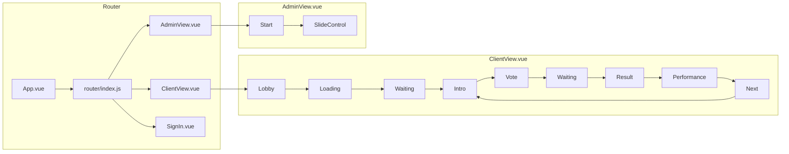
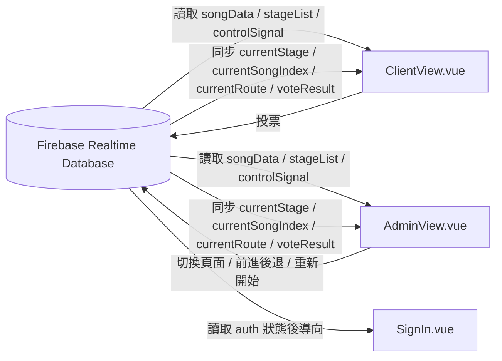

# 走走停停 —— 從臺灣經典歌謠裡走來的「她」

*一場結合音樂、香水、選擇的現場互動展演*
*An interactive live performance of music, fragrance, and choice.*
*To stay, or to go —— that is the question.*


## 活動簡介

* **核心概念：**
    許多傳統歌謠題材來自於相似的女性個性，從小被要求賢淑端莊、盼望嫁與好郎君、孤身等待郎君歸家等，在經典歌謠裡的女性似乎喪失了決定自己人生的選擇權。本專案將尋找以「花」為喻體的臺灣經典歌謠，藉由音樂創作來重新詮釋傳統民謠題材，並且結合香水製作體驗與觀眾票選互動，訴說現代獨立個體的人生故事。
* **三大形式：**
    「題材創作樂曲」、「自製香水體驗」、「觀眾投票互動」。

---

## 網站簡介

* **選擇互動：** 觀眾可以進行線上投票即時互動，決定主角接下來的人生選擇，選擇結果將會影響音樂、劇情以及動畫影像的發展與走向。
* **互動工具：** 現場提供 QR Code 掃描，觀眾可使用手機參與投票。
* **頁面結構：** 類似於kahoot。螢幕上提供封面、題目與選項、投票結果、相關動畫。在每一首曲目開始前皆會進行一次投票，需及時互動、統計結果要顯示於螢幕。
* **頁面視覺：** 封面、按鍵、選項結果之動畫與美術。可與視覺組之動態影像組溝通合作。

---

## 專案架構

### 目錄結構
```text
Florascent/
├─ public/                      # 靜態資源
├─ src/
│  ├─ App.vue                   # Vue 根元件，載入 router-view
│  ├─ main.js                   # Vue 應用程式入口
│  ├─ firebase.js               # Firebase 初始化與重置節點工具
│  ├─ assets_url.js             # 素材網址
│  ├─ constants.js              # 常數定義
│  ├─ components/
│  │  ├─ Header.vue             # 標題列，顯示標題、語言切換與作者或時間資訊
│  │  ├─ LandscapeGuard.vue     # 橫向顯示時提示觀眾把手機轉直向
│  │  ├─ LinkBox.vue            # 顯示並複製投影頁連結
│  │  ├─ Loading.vue            # 載入中動畫
│  │  ├─ Lobby.vue              # 觀眾進場時的語言選擇畫面
│  │  ├─ SignIn.vue             # 後台登入頁
│  │  ├─ admin/
│  │  │  ├─ SlideControl.vue    # 後台控制投影片與下一頁預覽
│  │  │  └─ Start.vue           # 後台開始控制頁，含投影頁連結
│  │  └─ stage/
│  │     ├─ Intro.vue           # 歌曲介紹頁
│  │     ├─ Next.vue            # 投影頁提示觀眾查看手機
│  │     ├─ Performance.vue     # 表演階段的投影黑屏觸發元件
│  │     ├─ Result.vue          # 投票結果頁
│  │     ├─ Vote.vue            # 投票頁，含反悔流程與倒數顯示
│  │     └─ Waiting.vue         # 活動說明與投票規則頁
│  ├─ router/
│  │  └─ index.js               # 路由設定
│  ├─ utils/                    # 投票、階段、素材與控制邏輯
│  └─ views/
│     ├─ AdminView.vue          # 後台頁面
│     └─ ClientView.vue         # 觀眾頁面
├─ DatabaseInit.json            # Firebase Realtime Database 初始資料範本
├─ database.rules.json          # Firebase Realtime Database 規則
├─ firebase.json                # Firebase Hosting 與資料庫設定
└─ index.html
```

### 頁面切換流程


### 資料同步流程


### 路由設計
* `/`：觀眾頁（直式、手機）。
* `/?role=projector`：投影頁（橫式）。
* `/admin`：後台控台（橫式）。
* `/sign-in`：登入頁。

---

## 技術與服務

* **Vue 3**：作為前端框架，負責整體畫面與互動流程。
* **Firebase**：負責身份驗證與即時資料同步。
    * `Firebase Realtime Database`：儲存控制訊號、歌曲資料與投票結果，讓前後台同步。
    * `Firebase Authentication`：用於後台與投影頁的登入驗證。
    * `Firebase Hosting`：提供網站部署與靜態資源發布。
* **Cloudinary**：存放歌曲、背景與動畫素材。
* **開發環境建議：**
    * Node.js `24.13+`
    * npm `11.8+`

---

## 資料結構

`DatabaseInit.json` 是 Firebase Realtime Database 的初始資料範本，結構如下：

```json
{
  "controlSignal": {
    "currentSongIndex": 0,
    "currentStage": "Waiting",
    "currentRoute": 0,
    "endTime": 0,
    "voteResult": []
  },
  "stageList": [
    {
      "index": 0,
      "list": ["Waiting", "Intro", "Vote", "Result", "Performance"]
    }
  ],
  "songData": [
    {
      "canRegret": true,
      "canChangeRoute": false,
      "isBroken": false,
      "characterLink": "link...",
      "waitingLink": "link...",
      "backgroundLink": {
        "horizontal": "link...",
        "vertical": "link..."
      },
      "author": {
        "Lyrics": {
          "en": "...",
          "zh-TW": "..."
        },
        "Composer": {
          "en": "...",
          "zh-TW": "..."
        }
      }, 
      "description": {
        "en": "...",
        "zh-TW": "..."
      },
      "index": 0,
      "options": [
        {
          "description": {
            "en": "...",
            "zh-TW": "..."
          },
          "id": "0-1",
          "regretText": {
            "en": "...",
            "zh-TW": "..."
          },
          "title": {
            "en": "...",
            "zh-TW": "..."
          }
        },
        {
          "description": {
            "en": "...",
            "zh-TW": "..."
          },
          "id": "0-2",
          "regretText": {
            "en": "...",
            "zh-TW": "..."
          },
          "title": {
            "en": "...",
            "zh-TW": "..."
          }
        }
      ],
      "question": [
        {
          "en": "...",
          "zh-TW": ".."
        }
      ],
      "title": {
        "en": "...",
        "zh-TW": "..."
      },
      "voteTime": 60
    }
  ],
  "voteStatistic": null
}
```

* **controlSignal**：控制目前歌曲、階段、路線、定時切換與投票結果，是前台與後台同步的核心。
    * `currentSongIndex`：目前播放到第幾首歌。
    * `currentStage`：目前所在的階段，例如 Waiting、Intro、Vote、Result、Performance。
    * `currentRoute`：目前使用的路線編號。
    * `endTime`：目前階段或投票的結束時間。
    * `voteResult`：這一次投票的結果清單。
* **stageList**：記錄每首歌會依序經過哪些階段。
    * `index`：對應歌曲的序號。
    * `list`：該歌曲在該歌曲的階段順序。
* **songData**：存放每首歌曲的完整內容與互動設定。
    * `title`：歌曲標題。
    * `description`：歌曲說明（位於 Intro Stage）。
    * `question`：投票題目（位於 Vote Stage）。
    * `options`：投票選項內容與對應反悔的文本（位於 Vote Stage）。
    * `backgroundLink` / `characterLink` / `waitingLink`：背景、動畫連結。
    * `author`：歌詞與作曲者。
    * `voteTime`：投票時間長度。
    * `canRegret` / `canChangeRoute` / `isBroken`：控制是否允許反悔、改變劇情路線或是否顯示破碎畫面。
* **voteStatistic**：儲存觀眾投票統計資料，包含時間與選擇的選項。後台依據這份資料判斷要切換哪條路線。初始為 `null`。
